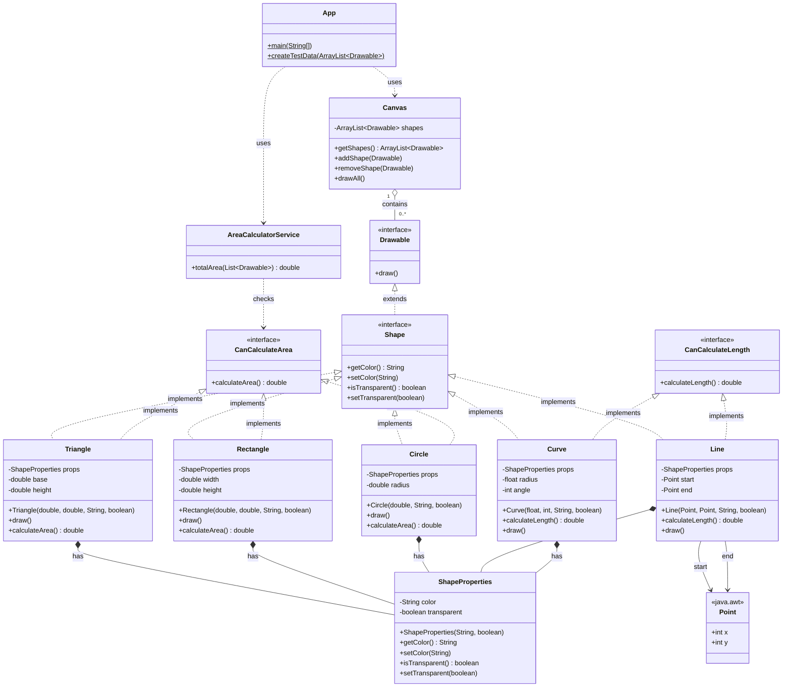

# Vector Draw App

A Java application demonstrating **composition over inheritance**, **SOLID principles**, and interface-based design through geometric shapes drawn on a canvas.

## Class Structure



- **Drawable** — interface declaring `draw()`; the broadest abstraction. `Canvas` and `App` depend only on this (DIP).
- **Shape** — interface extending `Drawable`; adds the color/transparency contract. Concrete classes implement this — no abstract class needed.
- **ShapeProperties** — plain data class holding `color` and `transparent`. Composed into each concrete shape (composition over inheritance). Shared state without shared class hierarchy.
- **Triangle / Rectangle / Circle** — implement `Shape` and `CanCalculateArea`; each *has a* `ShapeProperties` instead of extending an abstract class.
- **Line / Curve** — implement `Shape` and `CanCalculateLength`; each *has a* `ShapeProperties`. No area.
- **Canvas** — holds `ArrayList<Drawable>`; single responsibility: hold and draw. No area logic (SRP).
- **AreaCalculatorService** — single responsibility: sum areas from any `List<Drawable>`. Decoupled from `Canvas` (SRP). Works for any list of drawables from any source.
- **App** — orchestrates: wires canvas, service, and test data. Delegates all logic to the right class.
- **CanCalculateArea** — capability interface; implemented only by shapes that actually have area (ISP).
- **CanCalculateLength** — capability interface; implemented only by shapes that have length (ISP).
- **Point** — `java.awt.Point`; holds integer `x`/`y` coordinates used by `Line`.

---

## What is Maven?

**Apache Maven** is a build automation and project management tool for Java projects.  
It handles three main concerns for you:

| Concern | What Maven does |
|---------|----------------|
| **Build** | Compiles source code, runs tests, packages the result into a JAR/WAR |
| **Dependencies** | Downloads libraries from a central repository so you don't manage JARs manually |
| **Project structure** | Enforces a standard directory layout understood by every Maven-aware IDE and CI tool |

### Standard directory layout

```
vector-draw-app/
├── pom.xml                          ← Project Object Model (Maven config file)
└── src/
    ├── main/
    │   └── java/                    ← Production source code
    │       └── com/vectordraw/
    └── test/
        └── java/                    ← Unit test source code
            └── com/vectordraw/
```

### pom.xml — the heart of every Maven project

`pom.xml` (Project Object Model) is the single configuration file that describes the project.  
Key sections in this project's `pom.xml`:

```xml
<groupId>com.vectordraw</groupId>       <!-- Organisation / namespace -->
<artifactId>vector-draw-app</artifactId><!-- Project name -->
<version>1.0-SNAPSHOT</version>         <!-- Current version -->

<properties>
    <maven.compiler.source>17</maven.compiler.source>  <!-- Compile for Java 17 -->
    <maven.compiler.target>17</maven.compiler.target>
</properties>
```

`SNAPSHOT` means the version is still in development (not a final release).

---

## Maven build lifecycle

Maven organises work into **phases** that always run in order.  
The most important phases are:

```
validate → compile → test → package → verify → install → deploy
```

When you run a later phase, all earlier phases run automatically.  
For example, `mvn package` also runs `validate`, `compile`, and `test` first.

---

## Common Maven commands

### Compile source code
```bash
mvn compile
```
Compiles all `.java` files under `src/main/java/` into `target/classes/`.

### Run tests
```bash
mvn test
```
Compiles and runs all unit tests under `src/test/java/`.

### Package into a JAR
```bash
mvn package
```
Creates `target/vector-draw-app-1.0-SNAPSHOT.jar`.

### Clean build output
```bash
mvn clean
```
Deletes the `target/` folder (all compiled classes and JARs).

### Clean and repackage (most common full build)
```bash
mvn clean package
```

### Run the application directly with Maven
```bash
mvn compile exec:java "-Dexec.mainClass=com.vectordraw.App"
```

### Run the packaged JAR
```bash
java -jar target/vector-draw-app-1.0-SNAPSHOT.jar
```

### Skip tests during packaging (use sparingly)
```bash
mvn package -DskipTests
```

---

## Prerequisites

| Tool | Minimum version | Check with |
|------|----------------|-----------|
| JDK  | 17             | `java -version` |
| Maven | 3.8           | `mvn -version` |

---

## Quick start

```bash
# 1. Clone / open the project
cd vector-draw-app

# 2. Compile and run in one step
mvn compile exec:java "-Dexec.mainClass=com.vectordraw.App"
```

Expected output something like:
```
=== Drawing all shapes on canvas ===
Drawing Circle [radius=5.00, color=Red, transparent=false]
Drawing Rectangle [width=4.00, height=6.00, color=Blue, transparent=true]
Drawing Triangle [base=3.00, height=8.00, color=Green, transparent=false]
Drawing Circle [radius=2.50, color=Yellow, transparent=true]
Drawing Rectangle [width=10.00, height=3.00, color=Black, transparent=false]
Drawing Triangle [base=7.00, height=4.00, color=Purple, transparent=true]
====================================
Total area of all shapes: 178.17
```
